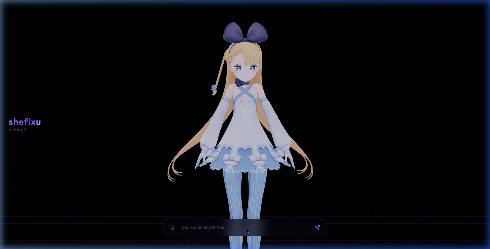

# shefixu — 3D AI Companion

A real-time 3D AI companion powered by a local TTS engine, OpenRouter LLM, and a VRM anime character with live facial expressions.



## 🎬 Demo

[](https://youtu.be/YOCZ-CZZWtw)

## ✨ Features

- **3D VRM Character** — Anime-style model with live lip-sync, blinking, head tracking, and idle animations
- **AI Brain** — Powered by [OpenRouter](https://openrouter.ai/) (DeepSeek V4 Flash by default — swap to any model)
- **Natural Voice** — [edge-tts](https://github.com/rany2/edge-tts) Python library served locally via FastAPI (`en-US-AnaNeural`, +10Hz pitch, +12% rate)
- **Voice Input** — Click the mic to talk; speech is transcribed and sent automatically
- **Interrupt** — Speaking while Aria is talking instantly stops her
- **Zero cloud dependency for TTS** — runs fully on your machine

## 🏗️ Tech Stack

| Layer | Technology |
|---|---|
| Frontend | React 19 + TypeScript + Vite |
| 3D Rendering | React Three Fiber + `@pixiv/three-vrm` |
| Animations | Framer Motion |
| LLM | OpenRouter API |
| TTS | Edge-TTS via local FastAPI server |
| Speech Input | Web Speech API (browser-native) |

## 🚀 Quick Start

### 1. Clone & install

```bash
git clone https://github.com/YOUR_USERNAME/shefixu.git
cd shefixu
npm install
```

### 2. Set up environment variables

```bash
cp .env.example .env
```

Open `.env` and add your API key:

```env
VITE_OPENROUTER_API_KEY=sk-or-v1-your-key-here
```

Get a free key at [openrouter.ai](https://openrouter.ai/).

### 3. Add your 3D model

Place your VRM model at:

```
public/model.glb
```

Any VRM 0.x model works. Free models: [VRoid Hub](https://hub.vroid.com/en).

### 4. Start the TTS server

Requires Python 3.11+ and `edge-tts`:

```bash
pip install edge-tts fastapi uvicorn
python3.11 tts_server.py
# Runs on http://127.0.0.1:8000
```

### 5. Start the dev server

```bash
npm run dev
# Open http://localhost:5173
```

## ⚙️ Configuration

### Changing the AI model

Edit `src/hooks/useAI.ts` — change the `model` field to any [OpenRouter model](https://openrouter.ai/models):

```ts
model: 'deepseek/deepseek-v4-flash',   // current default
model: 'google/gemini-2.0-flash-lite-001:free',  // free option
model: 'anthropic/claude-3.5-sonnet',  // high quality paid
```

### Changing the voice

Edit `src/hooks/useSpeech.ts`:

```ts
const VOICE = 'en-US-AnaNeural';  // change to any Edge TTS voice
```

List all available voices: `edge-tts --list-voices`

### Changing the character / system prompt

Edit the `content` in `src/hooks/useAI.ts` — this is the personality prompt for Aria.

## 📁 Project Structure

```
src/
├── components/
│   ├── ChatUI.tsx      — Chat interface + voice input
│   ├── Experience.tsx  — Three.js scene (lighting, camera, grid)
│   ├── Model.tsx       — VRM loader + animations + lip-sync
│   └── Character2D.tsx — (unused 2D fallback)
├── hooks/
│   ├── useAI.ts        — OpenRouter LLM integration
│   └── useSpeech.ts    — Edge TTS + audio analysis for lip-sync
tts_server.py           — FastAPI Edge TTS server
public/
└── model.glb           — Your VRM model (not included, add your own)
```

## 📝 License

MIT
